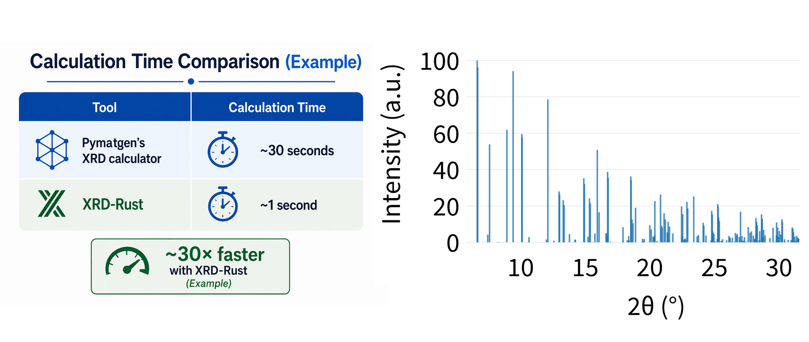
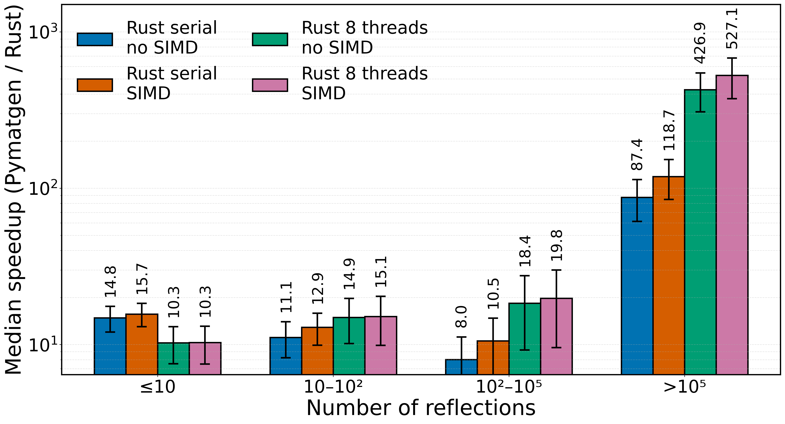

# XRD-Rust  
Compute powder X-ray diffraction (XRD) patterns using modified [pymatgen’s XRDCalculator](https://pymatgen.org/pymatgen.analysis.diffraction.html), with the performance-critical routines reimplemented in Rust, achieving typically more than ⚡10× speedup. The implementation further speeds up the original calculation workflow through SIMD vectorization and optional Rayon-based multithreaded parallelization. The larger and more complex your structure (more peaks and atoms), the greater the speedup gains.

The XRD-Rust follows the same notation as the XRDCalculator, with the only change being the renamed class, XRDCalculatorRust. Due to this, it can be easily implemented into existing workflows that use the original pymatgen package for powder XRD pattern calculations. Simply import the XRD-Rust package and replace the class name (see also example below).

```python
XRDCalculatorRust(
    wavelength   = "CuKa",   # str or float — radiation wavelength
    symprec      = 0,         # float — symmetry precision in Angstroms (0 = disabled)
    debye_waller_factors = None,
    parallel     = False,     # bool  — enable multi-threaded execution via Rayon
    num_threads  = 4,         # int   — number of threads (only used if parallel=True)
    use_simd     = True,      # bool  — enable SIMD vectorization
)
```



## Benchmarks
Benchmark results (2θ range = 2–60° (Mo radiation),  serial mode, SIMD) on two large crystallographic datasets demonstrate the following acceleration:

- COD (515 181 structures): ⚡10.7× median speedup (median absolute deviation, MAD 4.2×)  

- MC3D (33 142 structures): ⚡12.6× median speedup (MAD 2.0×)



Full benchmarking details are available at:
📖 https://doi.org/10.1107/S1600576726005273 (or https://arxiv.org/abs/2602.11709)

If you like the package, please cite:
- For **XRD-Rust**: Lebeda, Miroslav, et al. [Rust-accelerated powder X-ray diffraction simulation for high-throughput and machine-learning-driven materials science](https://doi.org/10.1107/S1600576726005273). Journal of Applied Crystallography, 2026, vol. 59, Part 4. DOI: 10.1107/S1600576726005273.
- For **pymatgen**: Ong, Shyue Ping, et al. [Python Materials Genomics (pymatgen): A robust, open-source python library for materials analysis](https://www.sciencedirect.com/science/article/abs/pii/S0927025612006295). Computational Materials Science, 2013, 68: 314-319.  

## How to install XRD-Rust
**Tested on: Python 3.10, 3.12, 3.13**    
*(Optional but recommended)* Create and activate a virtual environment to avoid potential dependency conflicts:

```bash
python -m venv xrd-rust_venv  
source xrd-rust_venv/bin/activate  # On Windows use: xrd-rust_venv\Scripts\Activate.ps1
```

Install the package:
```bash
pip install xrd-rust
```
## Example: Calculate powder XRD pattern
The following example loads a crystal structure from a CIF file ('structure.cif') and calculates its powder XRD pattern using the Rust-accelerated calculator. The pattern is computed with Cu Kα radiation over a 2θ range of 5 - 70°, with intensities normalized to a maximum of 100. Symmetry refinement is disabled (symprec=0), meaning the structure is used exactly as provided, without refining atomic positions for the found space group. The calculations are parallelized across 4 threads via the Rayon library and further accelerated using SIMD vectorization. The resulting pattern, including 2θ positions, normalized intensities, Miller indices, and reflection multiplicities, is saved to a CSV file.  

```python
from pymatgen.core import Structure
from xrd_rust_calculator import XRDCalculatorRust

# Load structure and calculate powder XRD pattern
structure = Structure.from_file("structure.cif")
calc = XRDCalculatorRust(wavelength="CuKa", symprec = 0,
    parallel = True, num_threads  = 4, use_simd = True)
pattern = calc.get_pattern(structure, scaled=False, two_theta_range=(5, 70))

# Save to file
with open("xrd_pattern.csv", 'w') as f:
    f.write("2theta,intensity,hkl,multiplicity\n")
    for i in range(len(pattern.x)):
        hkl_list = [tuple(h['hkl']) for h in pattern.hkls[i]]
        hkl_str  = str(hkl_list)
        mult     = sum(h['multiplicity'] for h in pattern.hkls[i])
        f.write(f"{pattern.x[i]},{pattern.y[i]},{hkl_str},{mult}\n")
```
